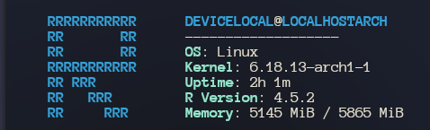

# rfetch
<<<<<<< HEAD
A Neofetch clone written in R
=======

A simple, lightweight system information tool written entirely in **R**. Because why use Bash, C, or Rust, when you can use a statistical programming language for a fetch script?



## Features:

- Side-by-side R-logo in ANSI and system info.
- Linux-specific memory and uptime detection via `/proc`.
- ANSI colour support.
- Zero dependencies (requires only base R).

## Installation:

1. **Clone the repo:**

git clone [https://github.com/Progressandfortuna/rfetch.git](https://github.com/Progressandfortuna/rfetch.git)
`cd rfetch`

2. **Make it executable:**
```
chmod +x bin/rfetch
```
3. **(Optional) Install to your path:**
```
sudo cp bin/rfetch /usr/local/bin/
```

## Usage:

Just run `rfetch` in your terminal after putting in your path.

## Requirements:

- R (3.0 or higher)
- Linux (Tested on Arch, should work on Debian and Fedora based distributions).
- Note that uptime and memory stats currently rely on `/proc`.

>>>>>>> d786ffe (Initial release of rfetch: Yet another fetch utility written in R)
